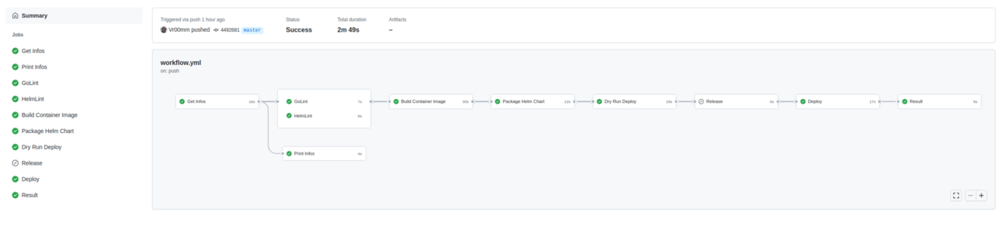

# base-github-workflow-ci-cd
[](https://github.com/Vr00mm/base-github-workflow-ci-cd/actions/workflows/workflow.yml)

This is my CI/CD base workflow for go micro-services in kubernetes.<br>


# The Gitflow


## Important
In your development process, you must strictly distinguish between Features, Fixes and Hot Fixes.

* **Features**, **Fixes** - are patches, which can wait until the next release of the product. This is why they travail starting from private feature branches ---> the central dev branch ---> the central release branch ---> the central master
* **Hot Fixes** - are the patches, which can't wait and must be applied directly on a release version of the product. This is why they have completely different path: a new private branch from the given tag on the central master  ---> central master.


## Branches
There are only a few long term branches - **master** and **dev**. All other branches should be deleted as soon as their commits are merged into the master or you don't need them.

Use the following command to find out branches, which a merged into the mainrepo/master:

### master/main branch
Contains all the stable, released code.     

 * All released versions of all modules should be tagged in the master. 
 * No separate branches for the released versions. 
 * The master branch is ready to build at any moment. 
 * No development should be performed on the master branch directly.
 * No direct push to master
 * The master branch rolls only forward, no history changes are allowed on the master branch.
 * All new patches are introduced in the master branch only via "git merge --ff-only".


### dev branch
* The branch is inherited from the latest master.
* The dev branch is a development mainstream.
* For each feature, developers MUST create a separate branch **feature** inherited from the **dev** branch.
* Should be rebased from the **master** each time **master** is changed.

### rc branch
RC or ReleaseCandidate branch is a temporary branch. This branch intends to provide uninterruptible development - to avoid such mails like "Please do not commit..., we freeze a branch" :).

At the moment of a release, we can branch from **dev** to create an **RC** branch to start a release procedure. It also means feature freeze on the **RC** branch and only bug fixes can be introduced on it - no commits with new features.

While a release manager works on the **RC** branch, all developers continue developing in **dev** and in their feature branches - uninterruptible development.

The branch should be deleted as soon as it has been merged with the **master**. Once the **RC** branch is merged into the **master**, the **dev** branch should be rebased from the **master**. The rebases might require [a parent commit change](#user-content-how-to-recover-after-upstream-branch-was-rebased), if git is not able to rebase automatically.

### HotFix branch
It is a branch for hot fixes. It should contain only urgent hot fixes for the released versions, which can't wait until the next scheduled release of the product.

Once a hot fix is merged back in to the **master**, the **dev** branch should be rebased from the master to get new changes.

The branch should be deleted as soon as merged with the master.

### Feature/Bugfix/Support branches
Development Feature/Bugfix/Support should have at least one branch. Such branches must be rebased to **dev** as often as possible to simplify future merging. 

Rebasing is important to keep new commits together for possible tuning or squashing in the feature.

Whenever a feature is ready (or a stable part of the feature) it can be merged with the **dev** branch.

It is recommended to keep feature branches even after their merge with **dev**. It will simplify fine tuning in case if the feature represented by the branch will be reverted from the **dev** for additional development or fixes/corrections.

Feature branches should be deleted as soon as their commits are merged into the **master** via the **dev** branch.

# The Gitflow git plugin

## Installation
```bash
sudo apt install git-flow
```

## Configuration
To configure git-flow in the project, execute ```git-flow init -d``` into the git repository.

## Create feature/bugfix/support branch
```
  # Replace feature with bugfix or support
  git flow feature start <name>
  git flow release finish <name>
```

# The Github workflow



## Requirements

### Secrets
You need to declare this secrets into git settings

| Secret Name              | Example                        | Description                  |
|--------------------------|--------------------------------|------------------------------|
| DOCKER_REGISTRY          | docker.io                      | The Docker Registry domain   |
| DOCKER_REGISTRY_TOKEN    | vr00mm                         | The Docker Registry username |
| DOCKER_REGISTRY_USERNAME | MySuperPasword                 | The Docker Registry password |
| HELM_REGISTRY            | https://chartmuseum.domain.com | Helm Repo URL                |
| HELM_REGISTRY_PASSWORD   | vr00mm                         | Helm Repo username           |
| HELM_REGISTRY_USERNAME   | MySuperPasword                 | Helm Repo password           |
| KUBECONFIG               | object{}                       | Kubeconfig Content           |


## Workflow Jobs

## Get Infos

This job determine some informations from github and share it with other jobs throught github outputs<br>

Its determine the current and next app and chart version based on existing tags.<br>

## Print Infos
Log the informations of the last job into console<br>

## GoLint
Use golintci to lint the golang application.<br>

## Helm Lint
Use helm to lint the helm chart.<br>

## Build Container Image
This job build the container image.<br>

It build the application in dedicated builder and delivery a distroless container<br>
It push this container to docker registry based on secret configuration<br>

## Package Helm Chart
This job package the helm chart<br>
Its template the chart for a first level of check.
It set the appVersion based on docker image version and chartVersion from  getInfos outputs

## Deploy dry-run
Its try to deploy the packaged charts into the kubernetes cluster in dry-run
Its permit to check the compatibility with the server

## Release
Its release the binary if we are on a tag branch

## Deploy
Its deploy the Helm chart into kubernetes

# The incoming
 - refacto semver plugin to deal with chart and app
 - add chart documentation auto-generation
 - improve workflow to get conditionnal docker / helm / deployment depending of commit destination / current branch/tag or project variable
 - improve workflow to deal with multiple cluster / deployment depending of current branch (ex dev, prod, internal-prod)